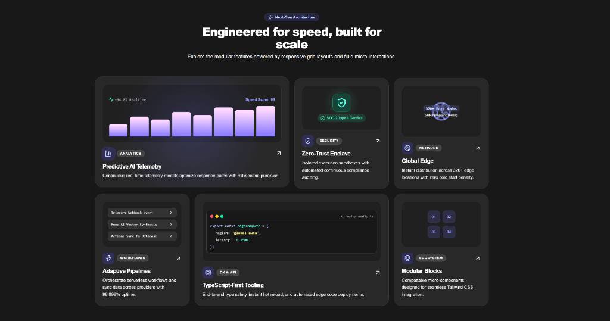

# ⚡ Next.js Bento Grid with Framer Motion & Lucide Icons

A modern, responsive Bento Grid UI built with Next.js (App Router), Tailwind CSS, Framer Motion, and Lucide React icons.


---

## 📸 Preview



---

## ✨ Features

- 📱 **Responsive Grid**: Adaptive Bento Grid layout spanning 1 column on mobile to 4 columns on desktop.
- 🎨 **Glassmorphic Aesthetic**: Dark-themed UI with subtle borders, dynamic spotlight gradient hover effects, and glowing indicators.
- 🚀 **Framer Motion Micro-Interactions**: Smooth card lift, spring-animated icons, animated telemetry bars, and interactive cards.
- 🛠️ **Automated Setup Script**: Includes `install-motion.ps1` for one-command installation of all required dependencies.
- 🔒 **Type-Safe**: Full TypeScript interfaces for clean composability.

---

## 📁 Project Structure

```
├── install-motion.ps1         # Automated PowerShell setup script
├── public/
│   └── bento-grid-preview.png # Live UI preview screenshot
├── src/
│   ├── app/
│   │   ├── globals.css        # Tailwind styling & themes
│   │   ├── layout.tsx         # Root application layout
│   │   └── page.tsx           # Demo landing page
│   ├── components/
│   │   └── BentoGrid.tsx      # BentoGrid & BentoGridItem components
│   └── lib/
│       └── utils.ts           # clsx + tailwind-merge helper (cn)
├── tailwind.config.ts         # Tailwind configuration
└── tsconfig.json              # TypeScript configuration
```

---

## 🚀 Quick Start

### 1. Automated Setup

**Option A: Run with PowerShell (Windows)**
```powershell
powershell -ExecutionPolicy Bypass -File .\install-motion.ps1
```
*Or via npm script:*
```bash
npm run setup
```

**Option B: Run with Bash (macOS / Linux / Git Bash)**
```bash
bash install-motion.sh
```

### 2. Standard Installation
```bash
npm install
```

### 3. Run Development Server
```bash
npm run dev
```

Open [http://localhost:3000](http://localhost:3000) (or `http://localhost:3001` if port 3000 is occupied) in your browser.

---

## 🧩 Usage Example

```tsx
import { BentoGrid, BentoGridItem } from "@/components/BentoGrid";
import { Zap, ShieldCheck } from "lucide-react";

export default function MyBentoSection() {
  return (
    <BentoGrid>
      <BentoGridItem
        className="md:col-span-2"
        badge="Analytics"
        title="Real-Time Telemetry"
        description="Continuous monitoring with sub-millisecond precision."
        icon={<Zap className="w-5 h-5" />}
      />
      <BentoGridItem
        className="md:col-span-1"
        badge="Security"
        title="Zero Trust Enclave"
        description="Isolated execution sandboxes with continuous auditing."
        icon={<ShieldCheck className="w-5 h-5" />}
      />
    </BentoGrid>
  );
}
```

---

## 📄 License
MIT License
